# DAY 3 – ACCESSIBILITY AUDIT

---

### Tool Used

Chrome Lighthouse

### Audit Scope

Accessibility audit of the modified landing page using Chrome Lighthouse.

---

## BEFORE

**Accessibility Score: 84**

### Issues Found

1. Buttons did not have accessible names.
2. Links did not have discernible names.
3. Insufficient color contrast.
4. Heading elements were not in sequential order.

### Before Evidence

#### Before – Accessibility Score 84

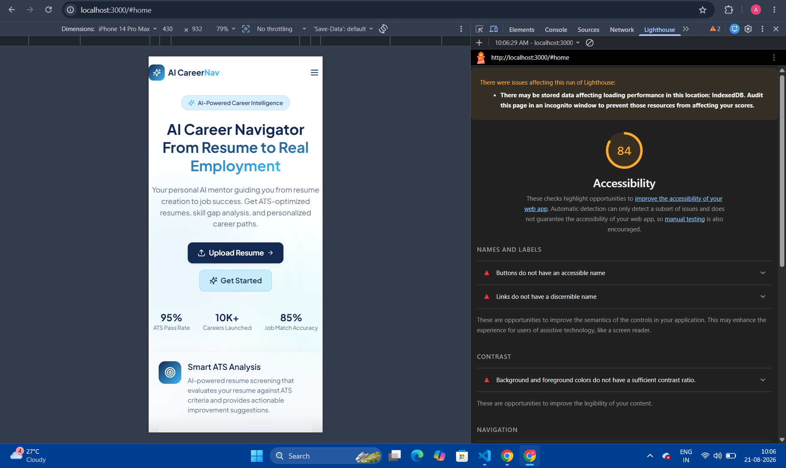

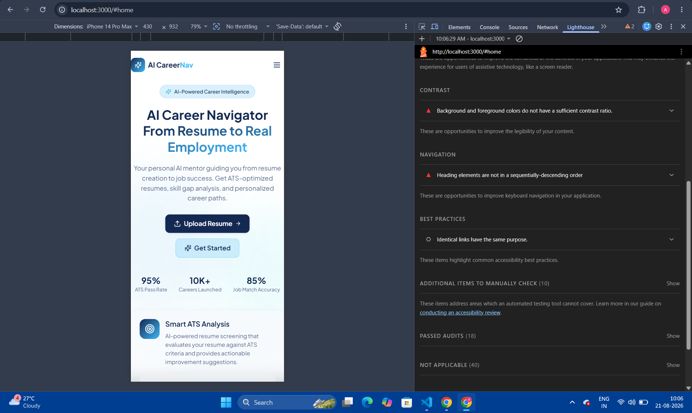

---

## FIXES APPLIED

1. Added `aria-label` and `aria-expanded` to the mobile navigation menu button.
2. Added `aria-label` to social media icon links in `Footer.tsx`.
3. Fixed heading hierarchy in `HeroSection.tsx` and `Footer.tsx`.
4. Fixed insufficient text/background contrast in `LandingNavbar.tsx` and `HeroSection.tsx`.x

---

## FILES MODIFIED

- `src/components/LandingNavbar.tsx`
- `src/components/Footer.tsx`
- `src/components/HeroSection.tsx`

---

## AFTER

**Accessibility Score: 100**

### After Evidence

#### After – Accessibility Score 100

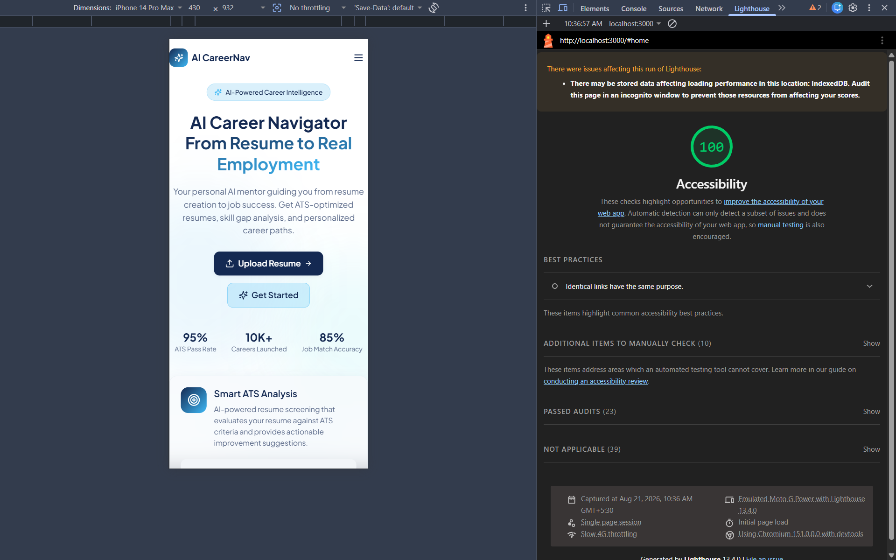

---

## RESULT

- Lighthouse Accessibility score improved from **84 to 100**.
- Previously detected accessibility issues were resolved.
- The modified landing page achieved a **100 Accessibility score** in the final Lighthouse audit.

**Status: COMPLETED**

---

# DAY 3 – LOW BANDWIDTH / SLOW 3G AUDIT

---

### Tool Used

Chrome DevTools Network

### Test Configuration

- Network throttling: **3G**
- Device: **iPhone 14 Pro Max** emulation
- Page tested: **Landing/Home page**

### Result

The landing page was tested under Chrome DevTools 3G network throttling.

- The page eventually loaded successfully under throttled network conditions.
- The UI was usable after loading completed.
- During the initial loading period, the loading skeleton was displayed.
- The loading skeleton remained visible while the page was loading under 3G.
- Network requests completed successfully.
- No major layout break was observed after the page finished loading.

### Network Failure State

The application was also tested with the browser network set to Offline.

- A user-friendly Network Error state was displayed.
- The user was informed to check the internet connection.
- A Retry button was provided to allow the user to retry the request/page load.
- The application did not rely only on the browser's default offline error page.

## FIXES APPLIED

1. Added a loading skeleton to the landing page so users see a placeholder UI while the page is loading.
2. Added network status detection using the browser `online` and `offline` events.
3. Added a user-friendly Network Error state when the browser is offline.
4. Added a Retry button to allow the user to retry the page load after restoring the network connection.

---

## FILES MODIFIED

- `src/pages/Index.tsx`

---

## AFTER

The landing page now displays a loading skeleton during the initial loading period under throttled 3G conditions.

When the browser is offline, the application displays a dedicated Network Error state with a Retry button instead of relying on the browser's default offline error page.

---

### Evidence

#### Initial Loading – Skeleton Displayed

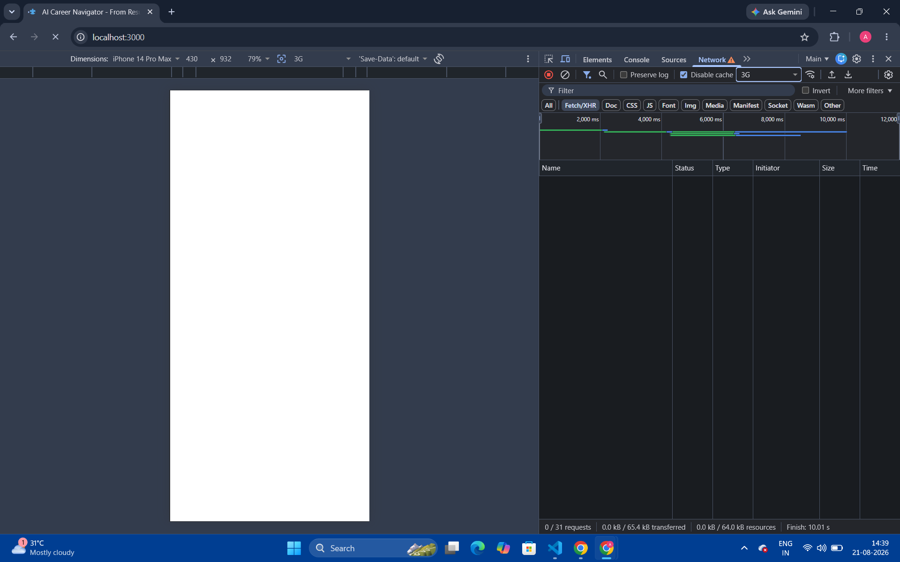

#### After Loading – UI Loaded

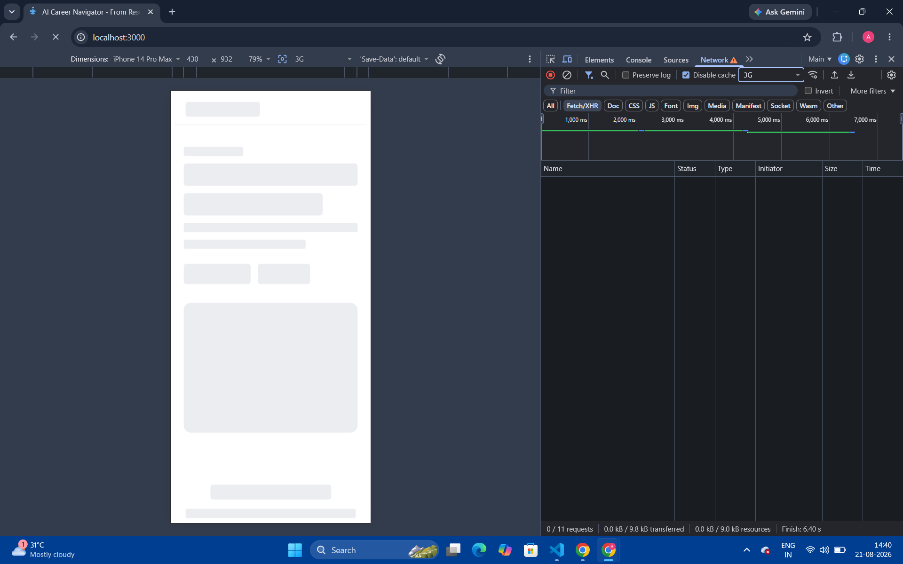

**#### Network Error – Before**

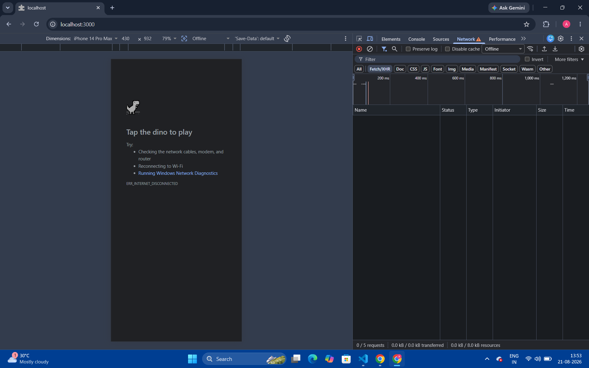

**#### Network Error – After**

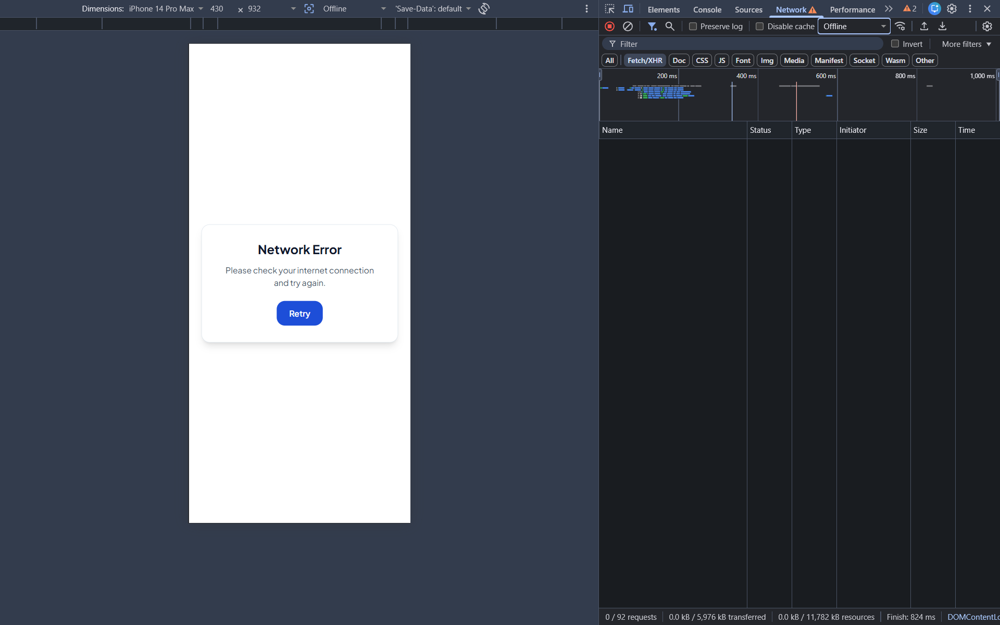

**Status: COMPLETED**

---

# DAY 3 – HARDENING CHECKLIST STATUS

---

### Accessibility & Keyboard Audit

**Status: COMPLETED**

- [x] Keyboard-only navigation verified using Tab, Shift+Tab, Enter, and Space.
- [x] Visible focus outlines verified on interactive elements.
- [x] Accessible names added where required.
- [x] Visible navigation controls verified.
- [x] Text/background contrast issues addressed.
- [x] Heading hierarchy corrected.
- [x] Final Lighthouse Accessibility score: **100**.

### Keyboard Navigation Evidence

Keyboard-only navigation was verified using Tab navigation.
The focus indicator remained visible and the tab order was verified.

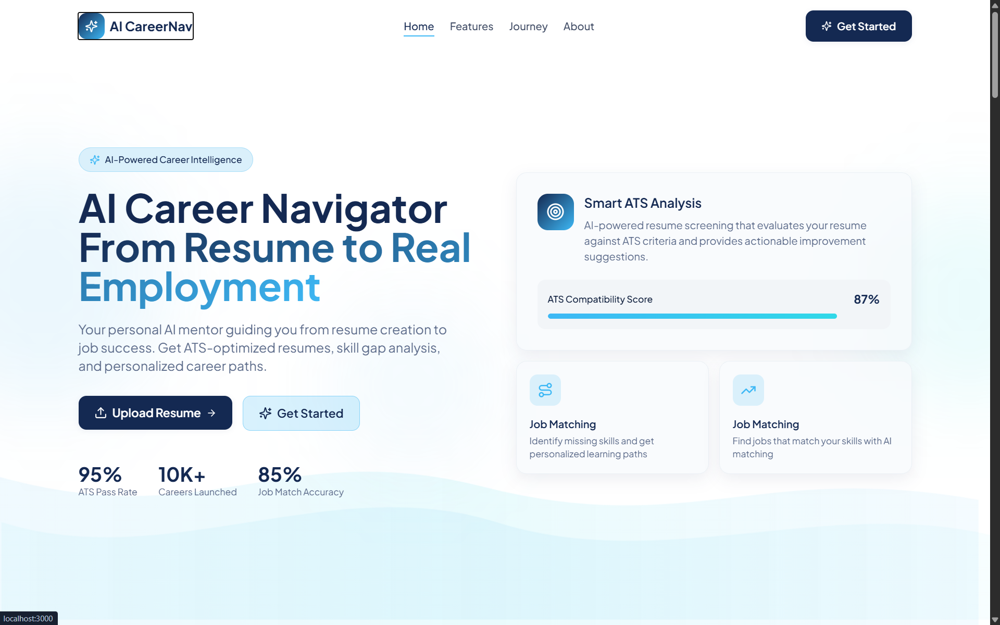

### Low Bandwidth

**Status: COMPLETED**

- [x] Network throttled to 3G.
- [x] Landing page tested under throttled network conditions.
- [x] UI became usable after loading completed.
- [x] Network requests completed successfully.
- [x] No major layout break was observed after loading.
- [x] Loading skeleton verified under 3G.
- [x] Network failure state and retry option verified.

### Student Privacy

**Status: COMPLETED**

- [x] Verified that no student names, emails, or minor user identifiers are leaked in URL parameters.

- [x] Verified that no student names, emails, or minor user identifiers are exposed in console logs.

- [x] Verified that no student/minor identifiers are unnecessarily included in telemetry payloads.

### Student Privacy Evidence

#### URL / Console Privacy Check

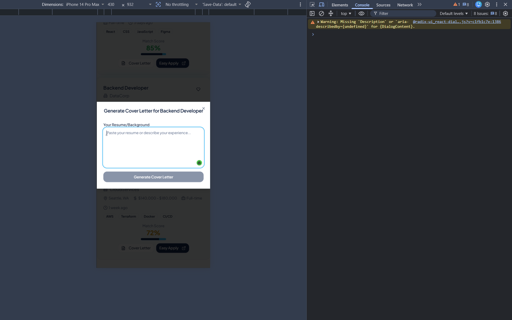

### Unit Testing

**Status: COMPLETED**

Unit testing was implemented for the Student Career Quiz component using React Testing Library and Vitest.

### Implementation / Fix Applied

Unit testing setup was added for the Student Career Quiz component.

1. Created `src/test/Quiz.test.tsx` for testing the Quiz component.
2. Configured Vitest with a `jsdom` environment for React component testing.
3. Added React Testing Library for rendering and querying components.
4. Added `userEvent` for simulating user interactions.
5. Added `jest-dom` for DOM assertions such as `toBeInTheDocument()` and `toBeChecked()`.
6. Added cleanup after each test to keep tests isolated.
7. Added test cases for rendering, answer selection, validation, navigation, progress tracking, quiz completion, score, percentage, review, answer status, and retaking the quiz.
8. Fixed the test setup so the complete React Quiz test suite could run successfully.
9. Verified the final test suite with 12 passing tests and 0 failed tests.

### Test Coverage

- [x] Quiz title and first question rendering
- [x] Four answer options rendering
- [x] Validation when no option is selected
- [x] Answer selection
- [x] Moving to the next question
- [x] Question progress tracking
- [x] Completing all 10 questions
- [x] Score calculation
- [x] Percentage calculation
- [x] Review of all questions after submission
- [x] Correct and incorrect answer status
- [x] Retaking the quiz

### Test Result

- **Test Files: 2 passed**
- **Tests: 12 passed**
- **Failed Tests: 0**
- **Status: PASSED**

### Unit Testing Evidence

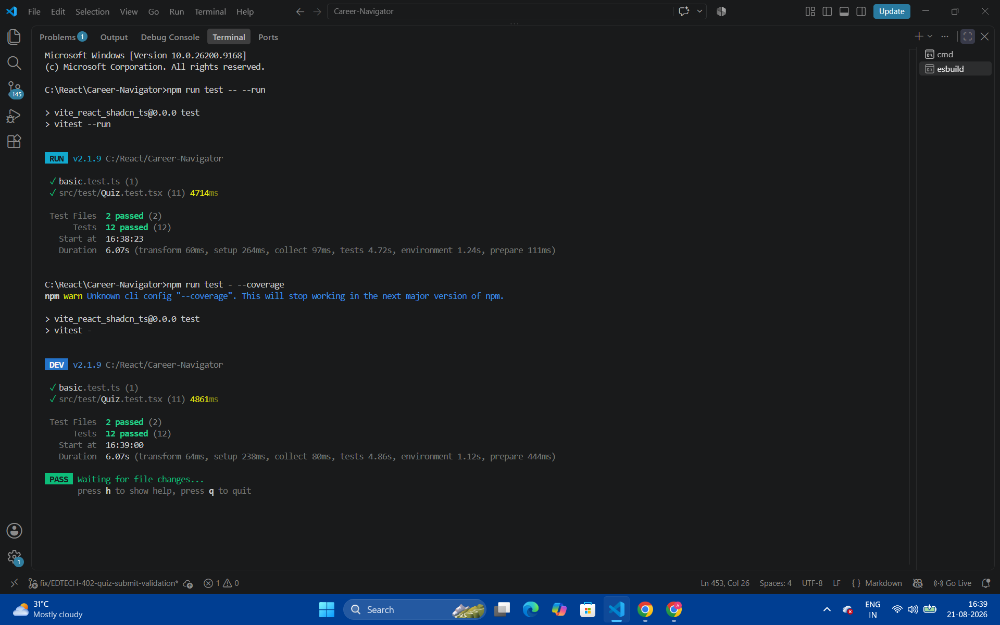

---

# TICKET #2 – RAG FOR CV ANALYSIS

---

### Feature Request

**Issue #2:** Implement RAG for CV Analysis to replace manual text pasting.

### Audit Scope

Resume screening PDF upload and resume text extraction flow.

---

## BEFORE

**Resume PDF Upload: Manual Text Pasting Required**

### Issues Found

1. Resume PDF could be uploaded, but the resume text was not automatically extracted.

2. The user had to manually copy the resume text from the PDF.

3. The user then had to paste the copied text into the Resume Content field.

4. This created an unnecessary manual step before starting resume analysis.

### Before Flow

PDF Upload
    ↓
PDF uploaded
    ↓
User manually copies resume text from PDF
    ↓
User pastes resume text into Resume Content
    ↓
Analyze Resume

---

### BEFORE Evidence

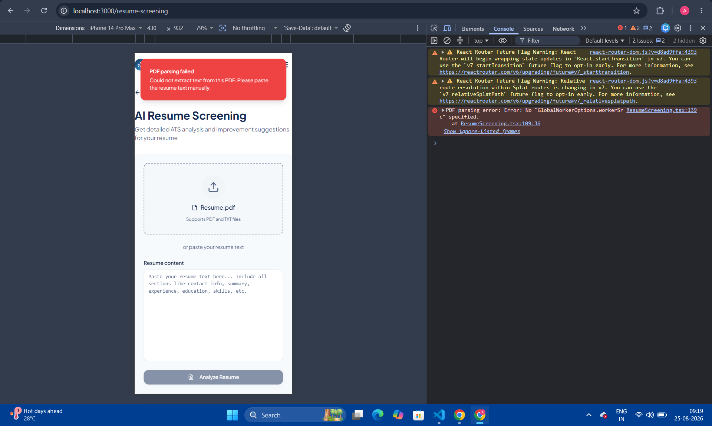

## FIXES APPLIED

1. Added `pdfjs-dist` for client-side PDF text extraction.

2. Configured the PDF.js worker using `GlobalWorkerOptions.workerSrc`.

3. Updated `ResumeScreening.tsx` to automatically parse uploaded PDF files.

4. Added page-by-page PDF text extraction.

5. Combined the extracted text from the PDF pages.

6. Automatically populated the extracted resume text into the Resume Content field.

7. Added successful PDF parsing feedback.

8. Added PDF parsing error handling.

9. Removed the manual resume text copy-paste requirement.

---

## FILES MODIFIED

- `src/pages/ResumeScreening.tsx`
- `package.json`
- `package-lock.json`

### `src/pages/ResumeScreening.tsx`

Updated the PDF upload and parsing logic to:

- Load uploaded PDF files using PDF.js.
- Configure the PDF.js worker.
- Extract text from PDF pages.
- Store the extracted resume text.
- Automatically populate the Resume Content field.
- Display parsing success and error feedback.

### `package.json`

Added the `pdfjs-dist` dependency required for PDF text extraction.

### `package-lock.json`

Updated automatically after installing the `pdfjs-dist` dependency.

---

## AFTER

**Resume PDF Upload: Automatic Text Extraction**

### Updated Flow

PDF Upload
    ↓
PDF.js loads PDF
    ↓
Text extracted automatically
    ↓
Extracted Resume Text
    ↓
Resume Content populated automatically
    ↓
Analyze Resume

### After Result

After uploading the resume PDF:

- PDF parsing completed successfully.
- Resume text was extracted automatically.
- Extracted resume content appeared in the Resume Content field.
- Manual copy-paste was no longer required.
- The PDF.js worker configuration issue was resolved.

### After Evidence

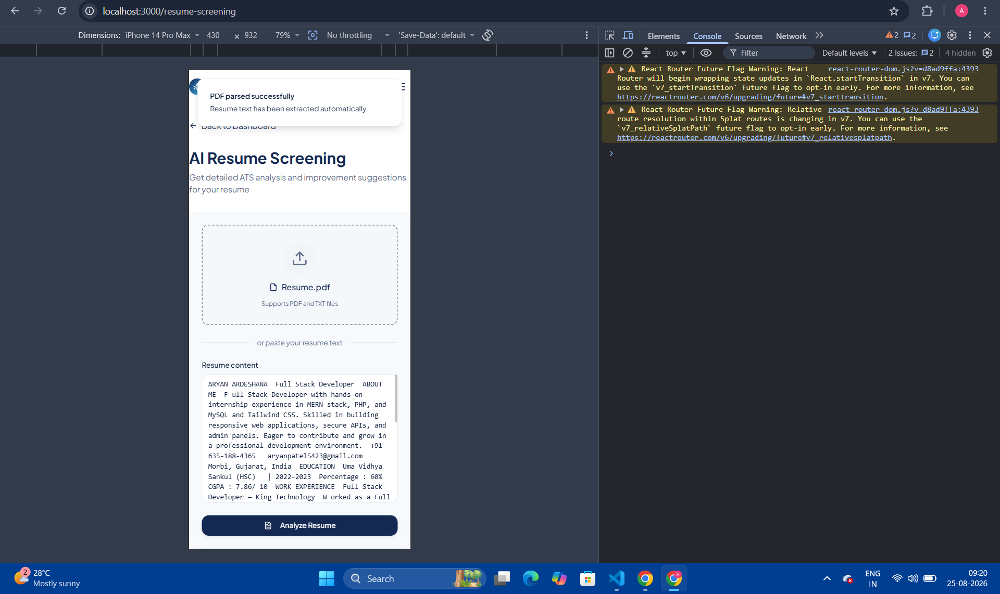

---

## VERIFICATION

The updated PDF upload flow was tested using a resume PDF.

### Test Steps

1. Opened the Resume Screening page.
2. Uploaded `Resume.pdf`.
3. Verified that the PDF was accepted successfully.
4. Verified that PDF.js processed the uploaded PDF.
5. Verified that resume text was extracted automatically.
6. Verified that extracted text appeared in the Resume Content field.
7. Verified the successful PDF parsing message.
8. Verified that the PDF.js worker error was resolved.

### Test Result

**PDF parsed successfully.**

**Resume text has been extracted automatically.**

The extracted resume content was displayed successfully in the Resume Content field.

---

## RESULT

- PDF upload works successfully.
- PDF text is extracted automatically.
- Resume Content is populated automatically.
- Manual resume text copy-paste has been removed.
- PDF.js worker configuration issue has been resolved.
- PDF parsing was successfully verified.

**PDF Extraction Result: SUCCESS**

**Status: COMPLETED**

---

# PR EVIDENCE

Before/After visual evidence has been captured for the accessibility audit.

### Before

The initial Lighthouse audit showed an Accessibility score of **84**, with the issues documented above.


### After

The final Lighthouse audit showed an Accessibility score of **100** after applying the fixes.


### Keyboard Navigation Evidence

Keyboard-only navigation was tested using Tab navigation.
Visible focus indicators were confirmed on interactive elements.


### Slow 3G Evidence

The landing page was tested with Chrome DevTools network throttling set to **3G**.

The loading skeleton was visible during the loading period, and the final UI appeared after loading completed.


These screenshots can be included in the Draft PR as visual proof.

### Network Failure / Retry Evidence

The application was tested with the browser network set to Offline.

A user-friendly Network Error state with a Retry button was displayed.


### Student Privacy Evidence

The application was checked for student privacy leaks in URL parameters and browser console logs.

No student names, emails, phone numbers, or other personal identifiers were exposed.


### Ticket #2 – RAG for CV Analysis

### Before


### After


## Evidence File Structure

Keep the Markdown report and screenshots in the following structure:

learner-flow-audit-updated.md

screenshots/

├── day3-accessibility-before-84-1.png
├── day3-accessibility-before-84-2.png
├── day3-accessibility-after-100.png
├── day3-keyboard-navigation.png
├── day3-network-error-before.png
├── day3-network-error-after.png
├── day3-slow3g-before-skeleton.png
├── day3-slow3g-after-skeleton.png
├── day3-privacy-console-logs.png
├── quiz-unit-testing.png
├── ticket2-pdf-parsing-before.png
└── ticket2-pdf-parsing-after.png

```

